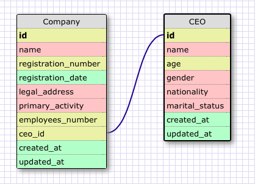
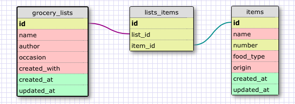

**Reflection**

*1. What is a one-to-one database?*

A one-to-one relationship exists in a database when one row in a table may be linked with only one row in another table and vice versa.

*2. When would you use a one-to-one database? (Think generally, not in terms of the example you created).*

I would use a one-to-one database when I have a relationship where a group of fields relating to the second table can all optionally be empty.

*3. What is a many-to-many database?*

A many-to-many relationship in a database exists when one row in a table may be linked with many rows in another table and vice versa.

*4. When would you use a many-to-many database? (Think generally, not in terms of the example you created).*

A many-to-many database can be used when the rows in the first table can map to multiple rows in the second table and those rows in the second table can also map to multiple (different) rows in the first table.

*5. What is confusing about database schemas? What makes sense?*

Sometimes, it's difficult to find good real life examples of a one-to-one relationship in databases.

